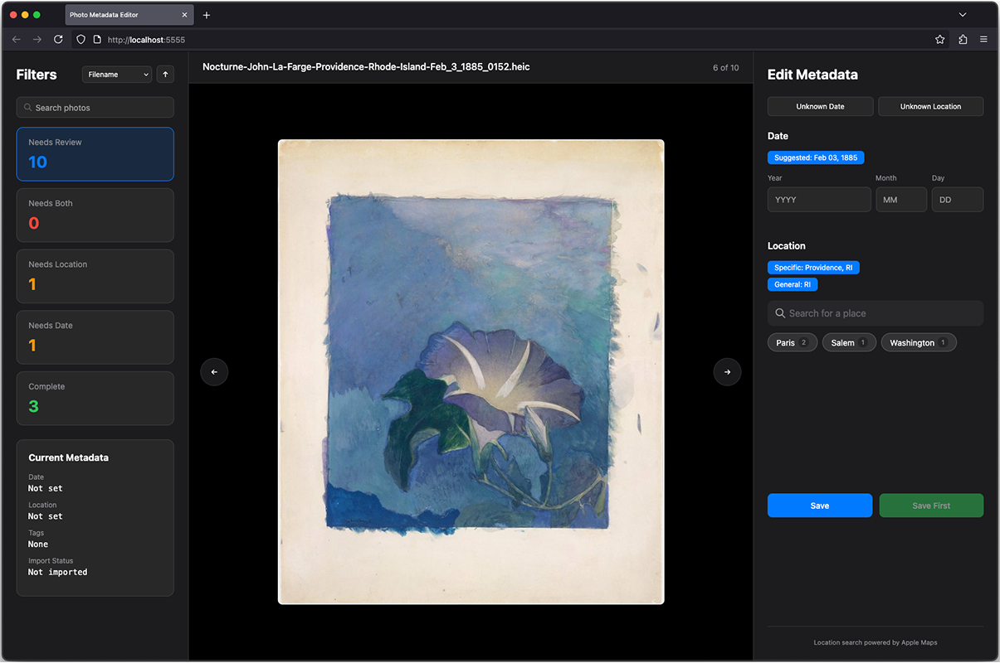
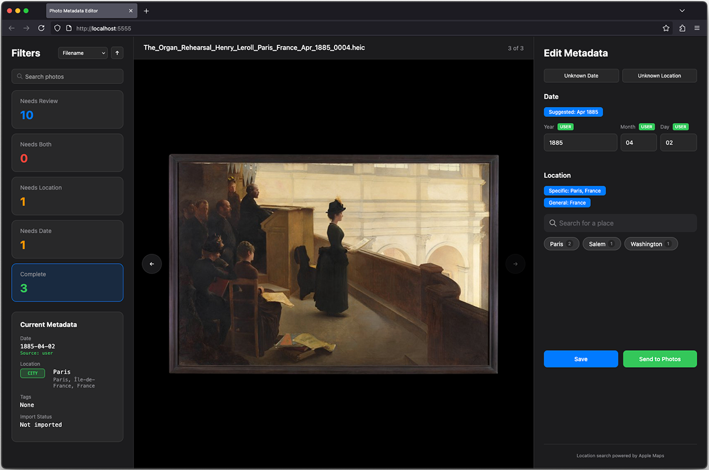
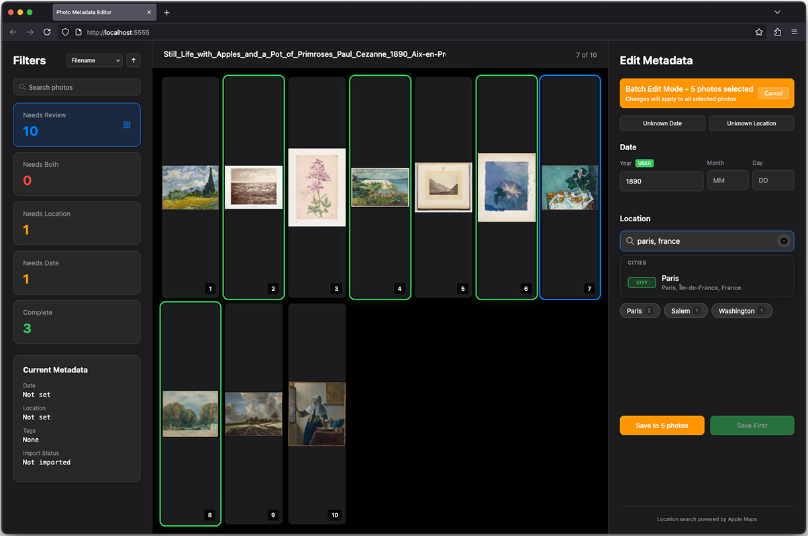

# Photo Metadata Editor

[](LICENSE)
[]()
[]()

<p align="left">
  
</p>

When you photograph or scan prints and negatives, the date and location information is often incorrect. This tool updates the metadata to reflect when and where the photos were actually taken. Once corrected, photos can be transferred between Macs with an optional automated Apple Photos import.

Read the story on my personal website: [Small Software: Metadata Editor](https://loganbarron.com/posts/2025-08-28-smallsoftware-metadata/)

## Features

- **Date and Location Detection** - Suggests date and location from filename using a finetuned LLM
  - Example: `Family_Reunion_Chicago_IL_July_4_1995_0351.heic` → Chicago, IL + July 4, 1995
- **Location Search** - Add location metadata using Apple Maps integration (cities, landmarks, addresses)
- **Photo Search** - Search across entire library by filename, date, location, or metadata
- **Grid View** - Browse thumbnails with 50-per-page pagination and batch selection
- **Mac-to-Mac Pipeline** - Transfer edited photos between Macs with automatic import to Apple Photos (optional)

## Screenshots


*Complete view showing photos that have corrected metadata*


*Grid view for batch selection and management*

## Demo Video

https://github.com/user-attachments/assets/5f3354a6-ae53-47bf-9a00-7ba3fe097616

*40-second demonstration of the Photo Metadata Editor in action*

## Quick Start

```bash
# Install uv package manager
curl -LsSf https://astral.sh/uv/install.sh | sh

# Clone repository
git clone https://github.com/logbarron/photo-metadata-editor
cd photo-metadata-editor

# Make script executable
chmod +x photo_metadata_editor.py

# First run (creates config file)
./code/photo_metadata_editor.py /path/to/photos

# Edit configuration
nano code/.env

# Run again to start
./code/photo_metadata_editor.py /path/to/photos
```

The web interface opens at http://localhost:5555

## Requirements

- macOS (tested on Sequoia 15.5)
- Photos in HEIC format

## Documentation

### Main Documentation
- [Setup Guide](docs/main/setup.md) - Installation and configuration
- [User Guide](docs/main/user-guide.md) - Complete usage instructions
- [Technical Reference](docs/main/reference.md) - Architecture, troubleshooting, performance
- [Pipeline Setup](docs/main/pipeline.md) - Mac-to-Mac transfer system
- [Development Notes](docs/main/development.md) - Design decisions and background
- [Quick Reference](docs/main/quick-reference.md) - Keyboard shortcuts, design patterns, icons
- [Mac B Undo Guide](docs/main/mac-b-undo-guide.md) - Removal of tools and code on Mac B

### Advanced Topics
- [Tool Development](docs/advanced/advanced-readme.md) - Tools for modifying the program

## Two-Part System

1. **Metadata Editor** - Fix dates and locations on one Mac 
2. **Pipeline System** - Transfer photos between Macs for Apple Photos import

## Important Notes

**This tool permanently modifies your photo files**. Original metadata is overwritten and cannot be recovered. Always maintain backups.

**AI-Assisted Development**: This project was developed with AI language models. While extensively tested, please review the implementation for your specific use case.

## License

[GPL v3](LICENSE) - Copyright © 2025 Logan Barron
