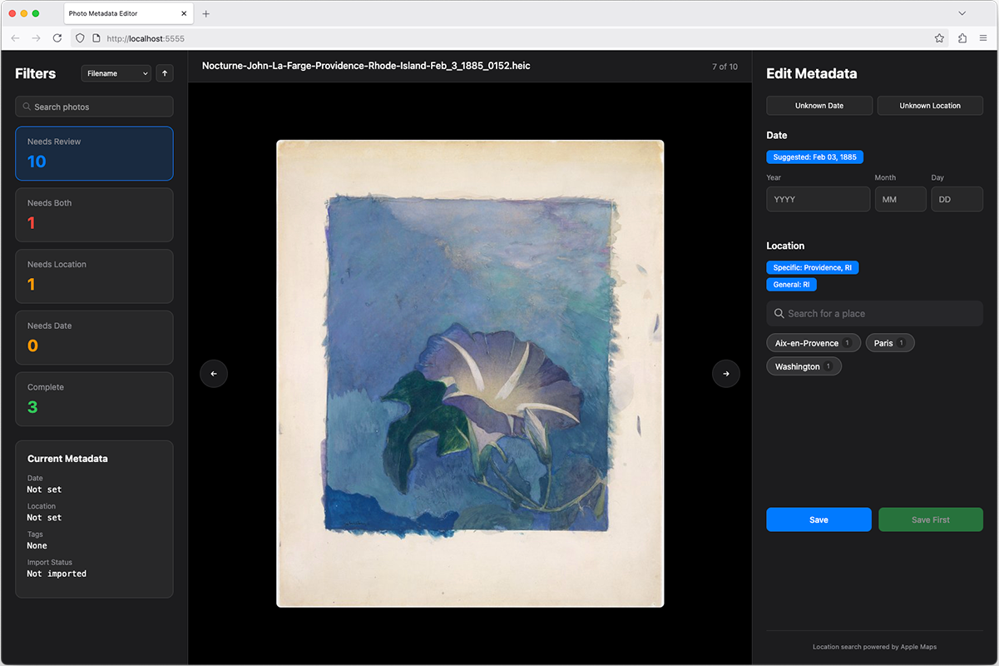
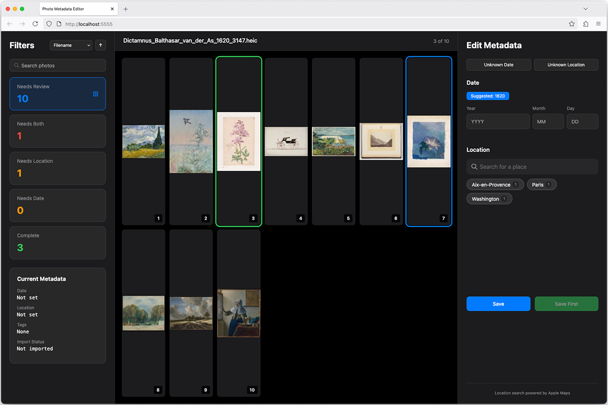

# Photo Metadata Editor

[](LICENSE)
[]()
[]()

<p align="left">
  
</p>

When you photograph or scan prints and negatives, the date and location information is often incorrect. This tool updates the metadata to reflect when and where the photos were actually taken. Once corrected, photos can be transferred between Macs with an optional automated Apple Photos import.

## Features

- **Smart Date Detection** - Extracts dates from filenames (`July_4_1995.heic` → July 4, 1995)
- **Smart Location Detection** - Extracts locations from filenames (`Chicago_IL.heic` → Chicago, IL)
- **Location Search** - Add location using Apple Maps integration (cities, landmarks, addresses)
- **Grid View** - Browse and select multiple photos with 50-per-page pagination
- **Mac-to-Mac Pipeline** - Transfer edited photos between Macs with automatic import to Apple Photos (optional)

## Screenshots


*Initial view showing photos that need metadata review*


*Grid view for batch selection and management*

## Demo Video

https://github.com/user-attachments/assets/e9d5d7d6-7f1a-4c5b-9a46-f8e383ec118d

*40-second demonstration of the Photo Metadata Editor in action*

## Quick Start

```bash
# Install uv package manager
curl -LsSf https://astral.sh/uv/install.sh | sh

# Clone repository
git clone https://github.com/logbarron/photo-metadata-editor
cd photo-metadata-editor

# First run (creates config file)
./code/photo_metadata_editor.py /path/to/photos

# Edit configuration
nano code/.env

# Run again to start
./code/photo_metadata_editor.py /path/to/photos
```

The web interface opens at http://localhost:5555

## Requirements

- macOS (tested on Sequoia 15.5)
- Photos in HEIC format

## Documentation

- [Setup Guide](docs/setup.md) - Installation and configuration
- [User Guide](docs/user-guide.md) - Complete usage instructions
- [Technical Reference](docs/reference.md) - Architecture, troubleshooting, performance
- [Pipeline Setup](docs/pipeline.md) - Mac-to-Mac transfer system
- [Development Notes](docs/development.md) - Design decisions and background
- [Quick Reference](docs/quick-reference.md) - Keyboard shortcuts, design patterns, icons
- [Mac B Undo Guide](docs/mac-b-undo-guide.md) - Removal of tools and code on Mac B

## Two-Part System

1. **Metadata Editor** - Fix dates and locations on one Mac 
2. **Pipeline System** - Transfer photos between Macs for Apple Photos import

## Important Notes

⚠️ **This tool permanently modifies your photo files**. Original metadata is overwritten and cannot be recovered. Always maintain backups.

⚠️ **AI-Assisted Development**: This project was developed with AI language models. While extensively tested, please review the implementation for your specific use case.

## License

[GPL v3](LICENSE) - Copyright © 2025 Logan Barron
